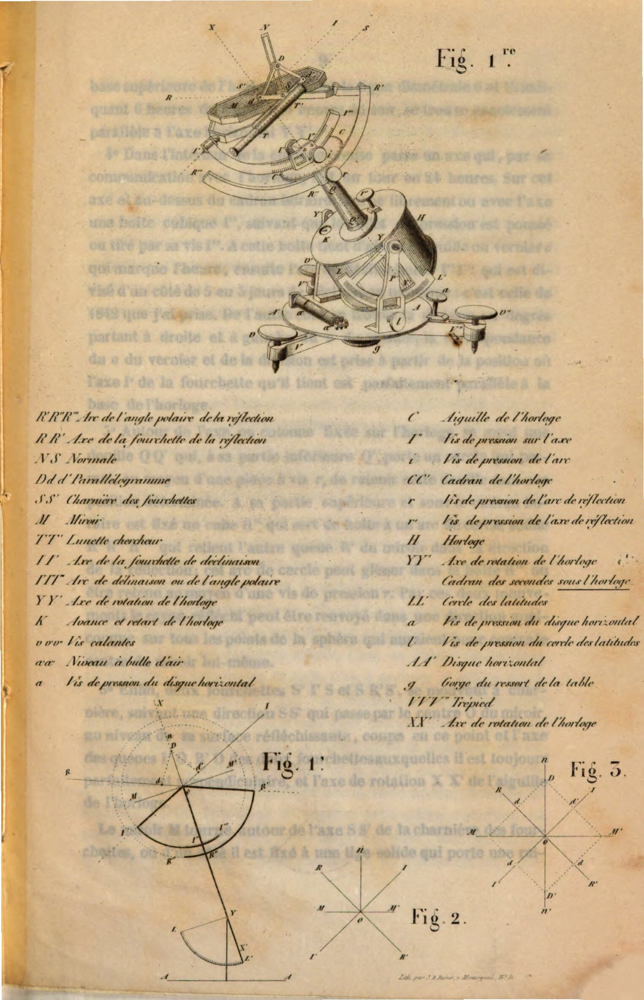

# Notice sur l'Héliostat

https://www.digitale-sammlungen.de/en/view/bsb10135195?page=,1

## Italiano by ChatGPT

P.3

Ho l'onore di sottoporre al giudizio dell'Accademia uno strumento che, pur non essendo nuovo nella sua specie, è tuttavia basato su principi che differiscono completamente da quelli applicati fino ad oggi da grandi fisici e artisti che hanno creato e semplificato l'eliostato, strumento di cui si tratta. Ho dovuto temere di proporvi uno strumento così delicato nel suo insieme, e di cui si sono occupati uomini così illustri; ma, fiducioso nella mia opera, che ha già ricevuto l'approvazione di molti degli onorevoli membri di questa assemblea, nonché di alcuni altri scienziati, mi era dovere presentarvelo, poiché la sua costruzione semplice, il facile orientamento e il prezzo che non raggiungerà di gran lunga quello degli altri, lo renderanno accessibile a tutti i gabinetti di fisica così come agli sperimentatori, il cui numero cresce costantemente e le cui importanti ricerche necessitano di un simile strumento.

Fahrenheit, intorno al 1700, che per primo per le esperienze ottiche continue, realizzò uno strumento per fissare il raggio riflesso sempre nello stesso punto, impiegò due specchi; ma la perdita di luce causata da questa doppia riflessione ne elimina l'impiego 

---------

P.4

nei casi in cui è necessaria molta luce. Si cercò quindi di eliminare uno degli specchi, cosa che fece S'Grawsend, applicando un altro principio di movimento; il suo strumento, di difficile impiego, fu perfezionato dapprima da Charles, che ne rese la pratica più comoda con il suo posizionatore; poi da Malus, che apportò alcune modifiche per diminuire la deviazione del raggio di luce riflesso dallo specchio. Infine, il signor Gambey, uno dei vostri illustri colleghi, adottò ancora un altro principio che rese questo utile strumento di un uso più comodo, proteggendolo dai calcoli o dai tracciati richiesti da quello di S'Grawsend, e porta, oltre alla sua eleganza, il marchio della grande perfezione di costruzione che il signor Gambey applica a tutti gli strumenti eseguiti sotto la sua direzione.

Tutti questi strumenti sono di difficile orientamento rispetto al meridiano del luogo, che deve essere conosciuto in anticipo per posizionare lo strumento. Adottando i principi dell'astronomia comuni agli altri, ma traducendoli diversamente in meccanica, credo di essere al riparo da tutte queste difficoltà di orientamento, di calcolo o di tracciato geometrico, senza allontanarmi dalla precisione; inoltre, il mio specchio, potendo assumere quasi tutte le posizioni possibili attorno al suo centro di figura, può quindi anche riflettere un raggio riflesso costante in qualsiasi direzione.

In tutti gli eliostati, lo specchio è guidato da una lancetta d'orologio il cui asse di rotazione è diretto parallelamente all'asse del mondo. Questa lancetta segue il movimento diurno del sole, e quindi compie come lui un giro in 24 ore. Ne risulta da questa situazione dell'asse di rotazione della lancetta, che il quadrante dell'orologio è parallelo all'equatore terrestre e orientato in modo tale che la lancetta che indica mezzogiorno e mezzanotte sia esattamente nel piano del meridiano del luogo. Gli eliostati differiscono tra loro per il rinvio del movimento della lancetta allo specchio riflettente e per l'applicazione diversa delle 

---------

P.5

condizioni meccaniche imposte dal movimento apparente del sole.

Queste condizioni sono, 1° l'angolo orario, cioè l'angolo che formano tra loro il piano del meridiano del luogo e un secondo piano che interseca il primo seguendo l'asse della Terra e passando per il centro del sole; e 2° l'angolo polare del sole, cioè l'angolo che la direzione verso il sole forma con l'asse terrestre. Il mio eliostato è quindi necessariamente composto da un orologio H, fig. 1, il cui asse QQ' e il quadrante CC' possono essere orientati come detto in precedenza. A tal fine, è sospeso a rotazione dalle estremità di un diametro orizzontale YY', perpendicolare a quello da mezzogiorno a mezzanotte CC', o perpendicolare al meridiano; l'asse di questa rotazione passa per il centro Y di un quarto di cerchio diviso LL' che serve per inclinare l'orologio secondo la latitudine del luogo, cioè per rendere l'asse della lancetta XX' parallelo a quello della Terra. Vedi anche la figura 1'.

Il prolungamento dell'asse di rotazione della lancetta porta due archi di cerchio I'I" I""', R'R''R concentrici; mobili attorno al loro diametro comune che coincide con l'asse della lancetta XX. Uno di questi archi I'I''' fissato a volontà sull'asse materiale della lancetta, contiene il sole I nel suo piano. La grandezza variabile di questi archi dipende da quella dell'angolo polare; dapprima per uno R'R'' da quello che il raggio riflesso ROR' forma con l'asse della lancetta XX'; e per l'altro quello II' che il raggio incidente IOI' forma con lo stesso asse XX'; questo arco variabile in grandezza secondo la declinazione del sole, è diviso da un lato in gradi, e numerato per indicare verso I' le declinazioni boreali e verso I''' quelle australi del sole; questi angoli si trovano iscritti nella Connaissance des Temps e nell'Annuaire del Bureau des Longitudes per ogni giorno dell'anno. Sull'altra faccia di questo stesso arco c'è una divisione di 5 in 5 giorni, indicando la declinazione media del giorno o quella dell'anno a uguale distanza da 2 bisestili: ho preso le declinazioni del 1842 come media; la divisione corrisponde ai giorni 1, 5, 10, 15, 20 e 25 di ogni mese indicato dalla sua iniziale e dalle date precedenti. Questa divisione 

-----

P.6

servirà solo come un'approssimazione sufficiente per esperimenti senza precisione e di breve durata, come generalmente per quelli dei corsi di fisica. Basterà far scorrere il cerchio nella sua guida fino a quando la declinazione o la data del giorno coinciderà con il riferimento o il vernier, per fissare la grandezza variabile dell'arco I'I'. Vedremo che si può anche fare a meno di queste due divisioni, e forse con vantaggio; ognuno sceglierà uno dei tre mezzi che sarà più a sua disposizione.

L'arco R'R''R, che deve contenere la riflessione nel suo piano, non ha bisogno di divisione; lo si farà ruotare sul suo asse mobile QQ' e lo si farà scorrere nella sua guida secondo la direzione assegnata al raggio da riflettere, e di cui si dirigerà direttamente l'immagine nel luogo desiderato, tramite i suoi due movimenti di scorrimento e di rotazione. Allora i due archi di cerchio saranno in una posizione tale che, se dall'estremità libera I' del cerchio di declinazione si traccia una linea retta al loro centro comune O, cioè un raggio I'O, questo raggio prolungato IOI passerà costantemente attraverso il sole I, poiché questo arco è trascinato dall'orologio che gli fa compiere una rivoluzione in 24 ore seguendo il sole; e per il secondo, la linea tracciata allo stesso modo dalla sua estremità R' e dal centro comune O, passerà per il punto R dove è riflessa l'immagine solare.

Abbiamo quindi due raggi distinti: uno OI' è costantemente sul prolungamento del raggio incidente IOI' che passa per il centro O, e l'altro OR' è sul prolungamento del raggio riflesso ROR' che passa allo stesso modo per il centro comune O dei due archi. È questo centro comune dove si incontrano il raggio incidente, il raggio riflesso e l'asse di rotazione della lancetta, che è allo stesso tempo il centro della figura dello specchio M.

Per capire come lo specchio è legato a questi due raggi, consideriamo dapprima questi due raggi o linee rette IOI', ROR', fig. 2. Ora, due linee rette che si intersecano sotto qualsiasi angolo e in qualsiasi direzione, potranno sempre essere comprese in un piano. È un risultato della definizione del piano in geometria. 

---------

P.7

Inoltre, poiché queste due direzioni II', RR' sono una l'incidenza, l'altra la riflessione, e poiché questo piano le contiene, sarà sempre il piano in cui avvengono l'incidenza e la riflessione. Se ora tracciamo in questo piano una linea retta che divide in due parti uguali l'angolo formato dall'incidenza e dalla riflessione, avremo così la normale allo specchio riflettente. Fig. 3.

Dato ciò, se, a uguale distanza dal punto di intersezione O di queste linee, segniamo due punti d e d', uno sul raggio incidente, l'altro sul raggio riflesso, oppure sul loro prolungamento d'' d''' o anche lateralmente d d'', d' d'', e se da ciascuno di questi punti tracciamo una parallela all'altro raggio, avremo due linee che completeranno un parallelogramma O d D d', o O d'' D' d'', o O d M d', e se attraverso il punto di incontro di queste due linee n, n', M o M', tracciamo la diagonale del parallelogramma, essa dividerà in due parti uguali l'angolo formato dai due raggi: sarà quindi anche la normale alla superficie riflettente o la superficie stessa. Non importa l'angolo che formeranno tra loro le nostre due direzioni, sempre il parallelogramma sarà formato, e sempre una delle sue diagonali dividerà il loro angolo in due parti uguali, cioè che sempre lo specchio m m' sarà convenientemente posizionato per compiere i fenomeni di riflessione che avvengono nel piano di questo parallelogramma.

È questa condizione del parallelogramma che è stata impiegata nel mio strumento; solo che, invece di completare il parallelogramma come detto, ho preferito prendere due lati uguali più lunghi di quelli del parallelogramma, il che non cambia affatto la direzione della normale rispetto ai due raggi, e che facilita questa condizione nella realizzazione. Sarà molto facile realizzare meccanicamente questa condizione geometrica. Ma poiché il centro dello specchio deve anche occupare questo centro comune, è stato necessario biforcare una porzione del raggio per mantenere lo specchio tra due forchette a cerniera e il cui asse di rotazione, sempre perpendicolare a ciascuno dei due raggi, passa anche per il centro comune O.

Dopo aver dettagliato l'apparecchio in qualche modo geometricamente, descriviamolo più meccanicamente.

----------

P.8

### Descrizione dell'eliostato

L'eliostato è composto da:

1° Un piede triangolare orizzontale V V' V" dotato di viti di regolazione v v' v''. Al suo centro ruota l'asse di un disco orizzontale A A, che porta un livello a' a" e due piedi P P' che supportano l'orologio H e lo specchio. Questo disco può essere fissato in un qualsiasi azimut mediante una pinza a vite a tenuta su una delle gambe del treppiede. La rotazione di questo disco, che trascina il livello, permette di posizionarlo in modo perfettamente orizzontale.
Orologio:

2° L'orologio è sospeso e può basculare tra i due supporti verticali P P' in modo che il suo asse di rotazione YY' rimanga sempre parallelo al disco orizzontale inferiore. L'arco di cerchio L L', che serve a mantenere il quadrante dell'orologio, è diviso in gradi con la divisione 0° sul raggio parallelo a questo quadrante in L, e 90° parallelo all'asse dell'orologio o all'asse della colonna che supporta lo specchio. Vicino al piede P si trova il punto di riferimento e un vernier; questo cerchio e il vernier servono a fissare il quadrante dell'orologio parallelamente all'equatore, utilizzando il grado di latitudine del luogo di osservazione. Una pinza a vite i serve a trattenere questo arco che è fissato all'orologio. 

**Nota**: L'orologio batte i quarti di secondo; alla sua base inferiore si muovono due lancette, una che compie un giro in 1 ora, l'altra in 300 secondi o 5 minuti; è diviso in secondi, ed è lì che si trova l'asse della molla; la lancetta dell'anticipo o del ritardo è sulla base superiore.

3° Sulla base superiore dell'orologio è fissata saldamente una colonna cava QQ' che, nella sua parte superiore, trattiene un quadrante C C' diviso in 24 ore, il cui piano è parallelo a quello della 

----------

----------

pagina vuota

----------

P.9

base superiore dell'orologio, e la cui linea diametrale 6 e 18, che indica le 6 del mattino e le 6 del pomeriggio, è esattamente parallela all'asse orizzontale YY'. 

4° All'interno della colonna cava passa un asse che, collegato all'orologio, compie un giro in 24 ore. Su questo asse e sopra il quadrante orario ruota liberamente o con l'asse una scatola cubica I', secondo che il colletto di pressione venga spinto o tirato dalla sua vite I". A questa scatola è attaccata dapprima la lancetta o vernier c che indica l'ora, poi l'arco di declinazione I' I"I" che è diviso da un lato in giorni medi di 5 in 5: ho preso la declinazione del 1842. Dall'altro lato si trova la divisione in gradi partendo a destra e a sinistra dallo 0 del vernier; la corrispondenza dello 0 del vernier e della divisione è presa a partire dalla posizione in cui l'asse I' della forchetta che esso tiene è perfettamente parallelo alla base dell'orologio.

5° Attorno all'asse o colonna fissata sull'orologio si muove una douille QQ' che, nella sua parte inferiore Q', porta un cerchio che permette, mediante una pinza a vite r, di trattenere questa douille in una posizione determinata. Nella sua parte superiore e sotto il quadrante orario è fissato un cubo R" che serve da scatola per un arco di cerchio solido K'R" R"" che trattiene l'altra estremità R' dello specchio nella direzione della riflessione; questo arco di cerchio può scorrere nella scatola R'' o essere trattenuto mediante una vite di pressione r. Con questi due movimenti, il raggio riflesso può essere inviato in una qualsiasi direzione su tutti i punti della sfera che avrebbero per centro il centro dello specchio stesso.
Fourchette e Miroir:

6° Infine, due forchette S'IS e SRS', che si muovono a cerniera, secondo una direzione SS' che passa per il centro O dello specchio, al livello della sua superficie riflettente, taglia in questo punto sia l'asse delle code I'O, R'O delle due forchette, alle quali è sempre perfettamente perpendicolare, sia l'asse di rotazione XX' della lancetta dell'orologio. 
Lo specchio M ruota attorno all'asse SS' della cerniera delle forchette, dove da un lato è fissato a una solida asta che porta una 

----------

P.10

scanalatura NS perpendicolare alla superficie dello specchio; in questa scanalatura scivola una spina che serve anche da cerniera ai due steli obliqui uguali, che sono fissati allo stesso modo a cerniera a distanza perfettamente uguale dall'asse della cerniera SS' delle forchette, per costituire il parallelogramma descritto in precedenza.
Infine, su uno dei lati IS della forchetta di incidenza S'IS, si trova un piccolo telescopio o cercatore TT', il cui asse ottico è parallelo all'asse di rotazione della sua coda I' o del raggio incidente; durante l'esperimento, mira sempre al sole. La forchetta fissa o di riflessione SRS' non ha mirino, è l'immagine stessa del sole che viene diretta sul punto desiderato; questa immagine è sempre nel piano del cerchio R'R".

-----------

P.11

### MESSA IN OPERA DELL'ELIOSTATO

Per prima cosa si carica l'orologio e lo si avvia imprimendogli movimenti di rotazione bruschi e opposti nel piano orizzontale, come si è obbligati a fare per mettere in movimento i cronometri e gli orologi marini, e talvolta anche gli orologi ordinari. Se successivamente l'orologio ritarda, il piccolo quadrante sull'orologio ha una lancetta che si può spingere verso "A" per avanzare, e viceversa, verso "R" se avanza.

#### Calibrazione

Si potrà inizialmente allentare la vite di pressione / che trattiene il quarto di cerchio L L' delle latitudini, in modo da posizionare verticalmente l'orologio e la colonna che sostiene lo specchio: si stringerà poi la vite 7. In questa posizione dello strumento, la calibrazione risulterà più semplice. Si dirigerà la lunghezza del livello parallelamente alla linea retta che unisce due delle viti calanti, ad esempio V' e V", mediante il piano orizzontale A A' che si renderà libero allentando la sua vite di pressione a. Per facilitare la calibrazione, ho diviso questo piano in quattro parti uguali mediante due diametri perpendicolari; si collegherà una delle estremità del diametro perpendicolare alla direzione del livello con il segno fatto sulla pinza della vite di pressione. Si avviterà o sviterà poi una o l'altra di queste due viti calanti, in modo da portare la bolla d'aria a occupare esattamente il centro del livello. Fatto ciò, si ruoterà questo cerchio di un quarto di giro; in questo modo il livello avrà una posizione perpendicolare alla precedente, o nella direzione della terza vite calante v; quindi, a seconda della posizione della bolla, si girerà o si allenterà solo questa vite fino a che la bolla occupi il centro delle sue divisioni. Sarà opportuno ripetere questa stessa operazione portando il livello a 180° dalle posizioni precedenti, immediatamente dopo ogni operazione, per assicurarsi che il livello sia ben 

---------

P.12

parallelo al piano che lo trattiene. Se accadesse che ruotandolo così di una semicirconferenza non tornasse allo stesso punto, allora il livello sarebbe stato disturbato, e si dovrà dividere la differenza in due, sollevando prima la vite che richiederebbe di essere sollevata solo della metà della differenza indicata dal livello; l'altra metà dell'errore verrà corretta dalle tre viti che trattengono uno dei capi del livello, e delle quali una trattiene le due laterali che contrastano con il cerchio.

#### Messa a Punto della Latitudine del Luogo

Una volta che la base è ben calibrata, si girerà verso il tramonto del sole o verso ovest il lato dell'apparecchio che porta il quarto di cerchio delle latitudini L L' fissato all'orologio; si farà coincidere il vernier che si trova sul supporto dell'orologio con il grado di latitudine del luogo dell'esperimento. Allora lo strumento riceverà un'inclinazione nel senso di quella del disegno. L'asse dell'orologio sarà parallelo all'asse terrestre, se il piano di inclinazione sarà nel piano del meridiano del luogo. Questa posizione, che è necessaria, si otterrà molto facilmente nel seguente modo.

#### Messa a Punto del Meridiano

Per mettere a punto il meridiano, si allenta la vite di pressione che trattiene l'arco superiore sull'asse dell'orologio, per poter girare questo arco in modo da allineare il segno sull'ago all'ora del quadrante solare, cioè all'ora vera al momento della posa; poiché l'orologio è caricato e funziona, si stringerà fortemente il pulsante che trattiene la scatola di questo cerchio sull'asse dell'orologio e 

----------

P.13

trascina il suo cerchio nel suo movimento di rotazione; si allenta il pulsante del cerchio diviso, si spingerà questo arco fino a che l'indice indicherà il giorno dell'esperimento su una o l'altra divisione: 1º sui gradi, il numero indicato nell'Annuario del bureau delle longitudini, o nella Conoscenza dei Tempi, e segnato accanto alla data dell'esperimento. Se questa declinazione è boreale come in estate, sarà la divisione più vicina all'asse della forchetta a servire; e in inverno, dove la declinazione è australe, sarà la divisione verso l'altra estremità dell'arco che si dovrà prendere. Allora, con la lancetta all'ora e l'arco alla declinazione, non rimarrà che mettere a punto il piccolo telescopio tirando il suo oculare, e dirigerlo verso il sole facendo ruotare tutto lo strumento con il cerchio orizzontale, senza disturbare le viti calanti, e poi fermare questo cerchio, e lo strumento sarà orientato rispetto al meridiano del luogo, e inoltre il raggio incidente sarà diretto, poiché quello nell'asse del telescopio è parallelo a questo raggio.

2º Se non si dispone della declinazione vera, si cercherà nella divisione in giorni la data del giorno dell'esperimento, che si metterà sotto il segno del riferimento; e poiché i giorni sono segnati solo di cinque in cinque, si dividerà ad occhio l'intervallo in cinque parti, e poiché può capitare che dal 25 al 28, 29, 30 o 31 a seconda del mese ci siano 4, 5, 6 o 7 giorni fino al 1º successivo, si terrà conto di ciò, e lo strumento orientato come precedentemente sarà orientato.

Infine, se non si conosce né la declinazione né la data del giorno, purché si conosca l'ora vera, necessariamente, all'ora indicata, il sole si troverà nel piano di questo arco, qualunque sia la sua declinazione; si mirerà quindi al sole dirigendo l'arco e il piano orizzontale simultaneamente, e quando il telescopio mirerà al sole lo strumento sarà orientato. Questo metodo, molto semplice, è forse il più preciso. 
Si potrà dirigere lo strumento anche facendo cadere l'ombra proiettata dall'estremità R''' su questo stesso arco: un solo segno servirà sempre da coincidenza.

----------

P.14

#### Riflesso dell'Immagine Solare
Per riflettere il raggio incidente sullo schermo, si allentano le due viti di pressione che trattengono la douille e l'arco del cerchio della riflessione, e si dirige l'asse della forchetta verso il punto dove si vuole avere la riflessione, girando l'arco della riflessione, prima con la sua douille o asse, e poi inserendo o estraendo l'arco più o meno dalla sua scatola che lo guida. Una volta riflessa l'immagine sul punto desiderato, si stringe la vite di pressione che è sulla base dell'orologio, poi quella dell'arco, e la riflessione è diretta e rimane in questa direzione che si trova nel piano del cerchio.

----------

P.15

### RIASSUNTO

Per riassumere in poche parole la procedura di orientamento,

1° Caricare l'orologio: L'orologio viene caricato e funziona per 24 ore.
2° Calibrare lo strumento: Lo strumento viene messo in calibrazione.
3° Impostare la latitudine: Si imposta il quarto di cerchio laterale sulla latitudine.
4° Regolare l'orologio: Si imposta la lancetta dell'orologio sull'ora corretta e si fissa l'orologio all'asse tramite la sua vite di pressione.
5° Impostare la declinazione: Si imposta il cerchio sulla declinazione del giorno o sulla data, oppure si utilizza il metodo finale per impostare la declinazione insieme al meridiano.
6° Allineare al meridiano: Si allinea l'asse dell'orologio al meridiano.
7° Dirigere il raggio riflesso: Si dirige il raggio riflesso e lo strumento inizia a funzionare.

++++++++++

Per garantire la buona realizzazione del mio Eliostato, posso affermare che ne ho affidato l'esecuzione al signor Soleil, ottico, in rue de l'Odéon, per *l'insieme*, e al signor Neumann, orologiaio, in rue de Seine-Saint-Germain, per l'orologio, entrambi artisti molto distinti, ognuno nel proprio campo, e ben conosciuti dagli uomini di scienza.

Al Conservatoire royal des Arts et Métiers,
il 27 febbraio 1843.

J.-T. SILBERMANN,
Preparatore di Fisica presso il Conservatoire des Arts
et Métiers e presso la Facoltà delle Scienze di Parigi.

--------------------------------

## Originale francese

P.3

NOTICE
SUR
UN HÉLIOSTAT
PRÉSENTÉ A L'ACADÉMIE DES SCIENCES
Par JEAN-THIÉBAULT SILBERMANN,
Le 28 Février 1843.

J'ai l'honneur de soumettre au jugement de l'Académie un Ins-
trument qui, sans être nouveau dans son espèce, est cependant
basé sur des principes qui diffèrent entièrement de ceux appliqués
jusqu'à ce jour par de grands physiciens et artistes qui ont créé et
simplifié l'Héliostat, instrument dont il s'agit.
J'ai dû craindre de vous proposer un instrument si délicat dans
son ensemble, et dont de si grands hommes se sont occupé; mais
confiant en mon œuvre qui a déjà reçu l'approbation de plusieurs
des honorables membres de cette assemblée, ainsi que de quelques
autres savants, c'était pour moi un devoir que de vous le présenter,
puisque sa construction simple, sa facile orientation, et son prix qui
n'atteindra pas à beaucoup près celui des autres, le rendront acces-
sible à tous les cabinets de physique ainsi qu'aux expérimentateurs,
dont le nombre se multiplie sans cesse et dont les importantes re-
cherches nécessitent un pareil instrument.
Farenheit, vers 1700, qui, le premier pour les expériences
d'optique suivies, réalisa un instrument pour fixer le rayon réfléchi
toujours au même point, employa deux miroirs; mais la perte de
lumière causée par cette double réflection, en élimine l'emplo

----------

P.4

dans les cas où il faut beaucoup de lumière. Aussi chercha-t-on à
supprimer l'un des miroirs, ce que fit S'Grawsend, en appliquant
un autre principe de mouvement; son instrument, d'un emploi
difficile, fut perfectionné d'abord par Charles, qui en rendit la
pratique plus commode par son positeur; puis par Malus, qui y
fit quelques changements pour diminuer la déviation du rayon
de lumière réfléchi par le miroir.
Enfin M. Gambay, l'un de vos illustres confrères, adopta encore
un autre principe qui rendit cet utile instrument d'un emploi plus
commode, en le mettant à l'abri des calculs ou tracés qu'exige celui
de S'Grawsend, et porte, outre son élégance, le cachet de la
grande perfection de construction qu'applique M. Gambay à tous
les instruments qui s'exécutent sous sa direction.
Tous ces instruments sont d'une orientation difficile par rapport
au méridien du lieu, qu'il faut connaître à l'avance pour poser l'ins-
trument.
Adoptant les principes d'astronomie communs aux autres, mais
les traduisant différemment en mécanique, je crois être à l'abri de
toutes ces difficultés d'orientation, de calcul ou de tracé géomé-
trique, sans m'écarter de la précision; de plus, mon miroir pouvant
prendre presque toutes les positions possibles autour de son centre
de figure, peut, par conséquent, aussi renvoyer un rayon réfléchi
constant dans une direction quelconque.
Dans tous les Héliostats, le miroir est conduit par une aiguille
d'horloge dont l'axe de rotation est dirigé parallèlement à l'axe du
monde.
Cette aiguille suit le mouvement diurne du soleil, et par consé-
quent fait comme lui un tour en 24 heures.
Il résulte de cette situation de l'axe de rotation de l'aiguille,
que le cadran de l'horloge est parallèle à l'équateur terrestre et
orienté de telle manière, que l'aiguille indiquant midi et minuit
soit exactement dans le plan du méridien du lieu.
Les Héliostats diffèrent entr'eux par le renvoi de mouvement
de l'aiguille au miroir réflecteur et par l'application différente des

------------

P.5

conditions mécaniques imposées par la marche apparente du soleil.
Ges conditions sont, 1° l'angle horaire, c'est-à-dire l'angle
que font entr'eux le plan du méridien du lieu et un deuxième plan
coupant le premier suivant l'axe de la terre et passant par le centre
du soleil; et 2° l'angle polaire du soleil, c'est-à-dire l'angle que
fait la direction au soleil avec l'axe terrestre.
Mon Héliostat se compose donc nécessairement d'une horloge H,
fig. 1, dont l'axe QQ' et le cadran CC' peuvent s'orienter comme
il a été dit précédemment. A cet effet, elle est suspendue à rota-
tion par les extrémités d'un diamètre horizontal Y Y', perpen-
diculaire à celui de midi à minuit C C', ou perpendiculaire au mé-
ridien; l'axe de cette rotation passe par le centre Y d'un quart de
cercle divisé L L' qui sert à incliner l'horloge suivant la latitude
du lieu, c'est-à-dire à rendre l'axe de l'aiguille XX' parallèle à
celui de la terre. Voir aussi la figure 1'.
777
Le prolongement de l'axe de rotation de l'aiguille porte deux
arcs de cercle I' I" I"", R' R'' R concentriques ; mobiles au-
tour de leur diamètre commun et qui se confond avec l'axe de l'ai-
guille XX. L'un de ces arcs l'I''' fixé à volonté sur l'axe matė-
riel de l'aiguille, contient le soleil I dans son plan.
La grandeur variable de ces arcs dépend de celle de l'angle
polaire; d'abord pour l'un R’R” de celui que fait le rayon réfléchi
ROR' avec l'axe de l'aiguille XX'; et pour l'autre celui II' que
fait le rayon incident IOI' avec le même axe XX'; cet arc va-
riable en grandeur suivant la déclinaison du soleil, est divisé d'un
côté en degrés, et chiffré pour indiquer vers l' les déclinaisons
boréales et vers I''' celles australes du soleil ; on trouve ces angles
inscrits dans la Connaissance des Temps et dans l'Annuaire du bureau
des longitudes pour chaque jour de l'année. Sur l'autre face de
ce même arc est une division de 5 en 5 jours, indiquant la décli-
naison moyenne du jour ou celle de l'année à égale distance de 2
bissextiles: j'ai pris les déclinaisons de 1842 pour moyenne;
la division correspond aux 1er, 5, 10, 15, 20 et 25 de chaque
mois indiqué par son initiale et les dates précédentes. Cette division

------------

P.6

ne servira que comme un à peu près suffisant pour les expériences
sans précision et de peu de durée, comme en général pour celles
des cours de physique. On n'aura qu'à faire glisser le cercle dans
sa coulisse jusqu'à ce que la déclinaison ou la date du jour coïncide
avec le repère ou le vernier, pour fixer la grandeur variable de
l'are I'I'. Nous verrons qu'on peut même se passer de ces deux
divisions, et peut-être avec avantage; chacun choisira celui des
trois moyens qui sera le plus à sa volonté.
L'arc R'R''R qui doit contenir la réflection dans son plan
n'a pas besoin de division; on le tournera sur son axe mobile QQ'
et on le glissera dans sa coulisse suivant la direction assignée au
rayon à réfléchir, et dont on dirigera directement l'image à l'en-
droit voulu, au moyen de ses deux mouvements de glissement et
de rotation.
Alors les deux arcs de cercle seront dans une position telle, que
si, de l'extrémité libre l' du cercle de déclinaison, on mène une
ligne droite à leur centre commun O, c'est-à-dire un rayon l' O, ce
rayon prolongé l'OI passera constamment par le soleil I, puisque
cet arc se trouve entraîné par l'horloge qui lui fait faire une révo-
lution en 24 heures et suivant le soleil; et pour le second, la
ligne menée de même par son extrémité R' et par le centre com-
mun O, passera par le point R où est réfléchie l'image solaire.
Nous avons donc deux rayons distincts : l'un Ol' est constamment
sur le prolongement du rayon incident IO l' passant par le centre 0,
et l'autre OR' est sur le prolongement du rayon réfléchi RO R❜
passant pareillement par le centre commun O des deux arcs.
C'est ce centre commun où se rencontrent le rayon incident, le
rayon réfléchi et l'axe de rotation de l'aiguille, qui est en même
temps le centre de figure du miroir M.
Pour concevoir comment le miroir est lié à ces deux rayons, con-
sidérons d'abord ces deux rayons ou lignes droites 101', ROR',
fig. 2. Or, deux lignes droites qui se coupent n'importe sous quel
angle et suivant quelle direction, pourront toujours être comprises
dans un plan. C'est un résultat de la définition du plan en géo-
métrie.

------------

P.7

De plus, comme ces deux directions II', RR' sont l'une l'inci-
dence, l'autre la réflection, et que ce plan les contient, il sera tou-
jours le plan dans lequel se font l'incidence et la réflection.
Si maintenant nous menons dans ce plan une ligne droite qui
partage en deux parties égales l'angle formé par l'incidence et la
réflection, nous aurons ainsi la normale au miroir réflecteur. Fig. 3.
Cela posé, si, à égale distance du point d'intersection O de ces
lignes, nous marquons deux points d et d', l'un sur le rayon incident,
l'autre sur le rayon réfléchi, ou bien sur leur prolongment ď” d””
ou même latéralement d d””, ď ď”, et si de chacun de ces points nous
menons une parallèle à l'autre rayon, nous aurons deux lignes qui
achèveront un parallelogramme O d D ď, ou O d'' D' d”, ou
O ď M³ d”, ou O d M d", et si par le point de concours de ces deux
lignes n, n', M ou M', on trace la diagonale du parallelogramme, elle
partagera en deux angles égaux l'angle formé par les deux rayons:
ce sera donc aussi la normale à la surface réfléchissante ou la sur-
face elle-même. N’importe l'angle que formeront entr'eux nos deux
directions, toujours le parallelogramme sera formě, et toujours l'une
de ses diagonales partagera leur angle en deux parties égales, c'est-
à-dire que toujours le miroir m m³ sera convenablement placé pour
accomplir les phenomènes de réflection qui se passent dans le plan
de ce parallelogramme. C'est cette condition du parallelogramme
qui a été employée dans mon instrument; seulement, au lieu d'ache-
ver le parallelogramme comme il a été dit, j'ai préféré prendre
deux côtés égaux plus longs que ceux du parallelogramme, ce qui
ne change nullement la direction de la normale par rapport aux
deux rayons, et qui facilite cette condition dans l'exécution.
Il sera très facile de réaliser mécaniquement cette condition géo-
métrique. Mais comme le centre du miroir doit aussi occuper ce
centre commun, il a fallu bifurquer une portion du rayon afin de
maintenir le miroir entre deux fourchettes à charnière et dont l'axe
de rotation, toujours perpendiculaire à chacun des deux rayons
passe aussi par le centre commun Ö.
Après avoir détaillé l'appareil en quelque sorte géométriquement,
décrivons-le plus mécaniquement.

---------

P.8

DESCRIPTION DE L'HÉLIOSTAT.
L'Héliostat se compose:
1. D'un pied triangulaire horizontal V V' V" muni de vis calantes
v v' v””; en son centre tourne l'axe d'un disque horizontal A A, qui
porte un niveau a' a" et les deux pieds P P' qui supportent l'hor-
loge H et le miroir; ce disque peut être fixé dans un azimuth quel-
conque au moyen d'une pince à vis a tenue sur l'une des branches
du trépied. C'est par la rotation de ce disque, qui entraîne le niveau,
qu'on le cale dans une position parfaitement horizontale.
2º L'horloge est suspendue et peut basculer entre ses deux sup-
ports verticaux P P' et de telle sorte que son axe de rotation
YY' reste toujours parallèle au disque horizontal inférieur. L'arc de
cercle L L', qui sert à maintenir le cadran de l'horloge, est divisé en
degrés ayant la division oº sur le rayon parallèle à ce cadran en L, et
le 90°, parallèle à l'axe de l'horloge ou à l'axe de la colonne qui
supporte le miroir; contre le pied P se trouve le point de repère et
un vernier; ce cercle et ce vernier servent à fixer le cadran de l'bor-
loge parallèlement à l'équateur, au moyen du degré de latitude du
lieu de l'observation. Une pince à vis i sert à retenir cet arc qui est
fixé à l'horloge.
NOTA. L'horloge bat les quarts de secondes; à sa base inférieure
se meuvent deux aiguilles, l'une faisant son tour en 1 heure, l'autre
en 300 secondes ou 5 minutes; elle est divisée en secondes, c'est là
aussi que se trouve l'axe du ressort; l'aiguille de l'avance ou du
retard est sur la base supérieure.
3º Sur la base supérieure de l'horloge est fixée solidement une
colonne creuse QQ' qui, à sa partie supérieure, retient un cadran
C C' divisé en 24 heures, dont le plan est parallèle à celui de la

---------

---------

(empty)

---------

P.9

base supérieure de l'horloge, et dont la ligne diamétrale 6 et 18 indi-
quant 6 heures du matin et 6 heures du soir, se trouve exactement
parallèle à l'axe horizontal Y Y'.
4º Dans l'intérieur de la colonne creuse passe un axe qui, par sa
communication avec l'horloge, fait un tour en 24 heures. Sur cet
axe et au-dessus du cadran horaire tourne librement ou avec l'axe
une boîte cubique I”, suivant que le collet de pression est poussé
ou tiré par sa vis I”. A cette boîte tient d'abord l'aiguille ou vernier c
qui marque l'heure, ensuite l'arc de déclinaison I' I"I" qui est di-
visé d'un côté de 5 en 5 jours de déclinaison moyenne : c'est celle de
1842 que j'ai prise. De l'autre côté se trouve la division en degrés
partant à droite et à gauche du o du vernier; la correspondance
du o du vernier et de la division est prise à partir de la position où
l'axe I' de la fourchette qu'il tient est parfaitement parallèle à la
base de l'horloge.
3º Autour de l'axe ou colonne fixée sur l'horloge se meut une
douille Q Q' qui, à sa partie inférieure Q', porte un cercle qui per-
met, au moyen d'une pince à vis r, de retenir cette douille dans une
position déterminée. A sa partie supérieure et sous le cadran ho-
raire est fixé un cube R" qui sert de boîte à un arc de cercle solide
K'R" R"" qui retient l'autre queue R' du miroir dans la direction
de la réflection; cet arc de cercle peut glisser dans la boîte R❞ ou
être retenu au moyen d'une vis de pression r. Par ces deux mouve-
ments le rayon réfléchi peut être renvoyé dans une direction quel-
conque sur tous les points de la sphère qui auraient pour centre le
centre du miroir lui-même.
6º Enfin, deux fourchettes S' I'S et S R'S', se mouvant à char-
nière, suivant une direction SS' qui passe par le centre O du miroir,
au niveau de sa surface réfléchissante, coupe en ce point et l'axe
des queues I' O, R' O des deux fourchettes auxquelles il est toujours
parfaitement perpendiculaire, et l'axe de rotation X X' de l'aiguille
de l'horloge.
Le miroir M tourne autour de l'axe S S' de la charnière des four-
chettes, où d'un côté il est fixé à une tige solide qui porte une rai-

---------

P.10

nure NS perpendiculaire à la surface du miroir; dans cette rainure
glisse juste une goupille qui sert en même temps de charnière aux
deux tigettes obliques égales, qui sont fixées de même à charnière à
distance parfaitement égale de l'axe de la charnière S S' des four-
chettes, pour constituer le parallelogramme précédemment décrit.
Enfin, sur l'un des côtés I S de la fourchette d'incidence S'IS,
se trouve une petite lunette ou chercheur T T', dont l'axe optique
est parallèle à l'axe de rotation de sa queue l' ou du rayon incident;
elle vise toujours sur le soleil pendant l'expérience. La fourchette
fixe ou de réflection S R S' n'a point de viseur, c'est l'image elle-
même du soleil qui est dirigé sur le point voulu; cette image est
toujours dans le plan du cercle R' R".

---------

P.11

HÉLIOSTAT MIS EN EXPÉRIENCE.

