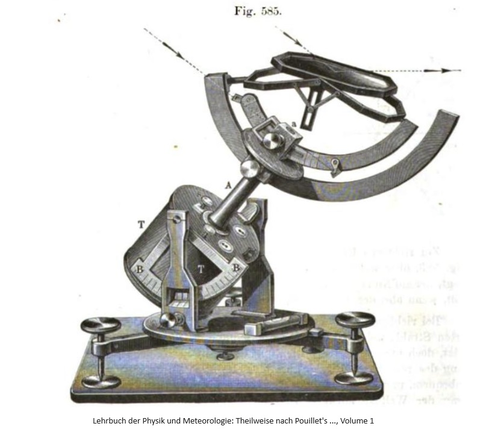
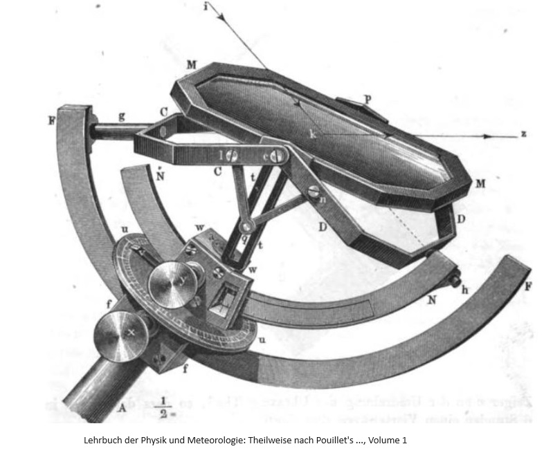
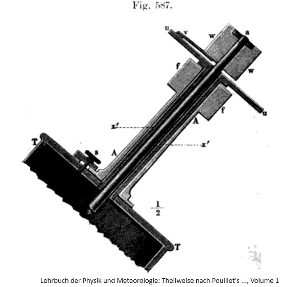

[Lehrbuch der Physik und Meteorologie: Theilweise nach Pouillet's , Volume 1](https://books.google.it/books?id=nHYPAAAAYAAJ&pg=PA595&lpg=PA595&dq=heliostat+nach+meyerstein&source=bl&ots=A0Vu4Tf4Oe&sig=ACfU3U2kyIf5tk0FWBu8JKccrp_KzC1i5g&hl=it&sa=X&ved=2ahUKEwiS77egoOyGAxWE7gIHHeSeDCE4ChDoAXoECAMQAw#v=onepage&q=587&f=false)

**L'eliostato di Silbermann** è rappresentato nella figura 585 in scala 1/4; la parte superiore dello stesso è nella figura 586 e una sezione della colonna **A** è nella figura 587 a pagina 520, in scala 1:2.

Quando lo strumento è correttamente posizionato, l'asse della colonna **A** coincide con la direzione dell'asse terrestre. Tuttavia, questa colonna **A** è composta da tre parti concentriche che si incastrano l'una nell'altra, di cui la centrale, indicata con **x** nella figura 587, è un involucro fissato sulla superficie superiore del cilindro **T**, che non può essere ruotata in alcun modo. All'estremità superiore di questo involucro è fissato il disco circolare perforato al centro **uu**, che funge da quadrante dell'orologio. L'intero perimetro è diviso in 24 ore, ciascuna ora è ulteriormente suddivisa in 12 parti uguali, in modo che lo spazio tra due segni consecutivi corrisponda a un intervallo di 5 minuti.

Il piano verticale che passa attraverso l'asse della colonna **A**

-------------

P.519

interseca il quadrante nei due segni corrispondenti al mezzogiorno e alla mezzanotte, contrassegnati con 12.

Su questo involucro fisso, che termina in alto con il quadrante **uu** *[errore nel testo, il quadrante è indicato con "x"]*, 

è montato un secondo involucro liberamente ruotabile attorno al primo, che costituisce la parte esterna della colonna **A** e che può essere immobilizzato tramite una vite di bloccaggio **s**. In alto, questo involucro rotante termina con un cubetto **ff**, in cui l'arco di ottone **FF** (figura 586), può scorrere e può essere fissato in qualsiasi posizione tramite la vite di bloccaggio **x**.

La parte più interna della colonna  **A** è formata da un asse metallico **aa**, che viene ruotato una volta in 24 ore dal meccanismo orario contenuto nel tamburo **T**. All'estremità superiore di questo asse è montato un cubetto **w**, che può ruotare liberamente attorno a questo asse, e all'interno del quale l'arco di ottone **NN** può essere spostato e fissato in qualsiasi posizione tramite la vite di bloccaggio **y** , figura 586. Su questo cubo **w** è fissata una lancetta **v**, che si muove sopra la scala oraria del disco fisso **uu** quando **w** viene ruotato attorno al suo asse.

-----------

p.520

Una vite di bloccaggio posta sul retro del cubo **w**, quindi non visibile nella nostra figura, può fissare il cubo **w** saldamente al suo asse. Se ciò avviene, il cubo **w** non può più ruotare liberamente, ma partecipa alla rotazione dell'asse dell'orologio **a**, in modo che

la lancetta **v** percorra un quarto di cerchio in 6 ore.

Se la colonna **A** è parallela all'asse terrestre e la lancetta **v** è posizionata alle 12, l'arco di ottone **NN** cade nel piano del meridiano. Se il cubo **w** viene regolato in questa posizione esattamente nel momento in cui il sole culmina e viene immediatamente fissato al suo asse, la lancetta **v**, ruotata dal meccanismo orario, indicherà 1, 2, 3, ecc. all'una, alle due, alle tre, ecc., e contemporaneamente l'arco **NN** sarà ruotato attorno all'asse terrestre in modo che il suo piano coincida sempre con il cerchio delle ore del sole.

Rivolgiamoci ora all'osservazione dello specchio e del suo movimento.

Il centro dello specchio **MM**, figura 586, si trova nel prolungamento della colonna **A**. Su un lato della cornice dello specchio è fissata una guida scanalata **t**, che è perpendicolare al piano dello specchio, quindi parallela alla normale d'incidenza dei raggi che cadono sullo specchio.

Lo specchio **MM** è sostenuto da due forcelle **CC** e **DD**, che sorreggono lo specchio da un lato in **c** e dall'altro in **p**. Un perno di

-----------

P.521

metallo **g** costituisce il prolungamento della linea  immaginaria che passa al centro della forcella **C**; il perno di metallo **h** costituisce il prolungamento della linea immaginaria che passa al centro della forcella **D**. Il perno **h** è agganciato a un'estremità dell'arco di ottone **NN**, e allo stesso modo il perno **g** è agganciato a un'estremità dell'arco **FF**. Alla forcella **CC** è consentita una rotazione attorno all'asse del perno **g**, mentre il perno **h**, solidale con la forcella **D**, è libero di ruotare nell'apertura cilindrica in cui è inserita.

Tramite l'asticella **lq** la forcella **CC** è collegata, così come tramite la barra **nq** lo è la forcella **DD*,  alla guida **tt** in modo tale che le estremità delle barre presso **l**, **n** e **q** possano ruotare intorno ai perni di collegamento, e che le due estremità inferiori delle barre in **q** siano costrette a rimanere nella fessura della guida **t** dal  perno che le tiene insieme.
Dato che **cl** = **cn** e **lq** = **nq**, il triangolo **lqc** è uguale al triangolo **ncq** [avrebbe più senso indicarlo con **nqc**], qualunque sia l'angolo formato dalle barre **nq** e **lq** in **q**. Da ciò  consegue che il piano della forcella **CC** e il piano della forcella **DD** formano sempre angoli uguali con la guida **t** e quindi anche angoli uguali con il piano dello specchio **MM**. Se un raggio di luce **ik** cade sullo specchio in una direzione tale che il suo prolungamento coincide con la linea immaginaria che passa al centro della forcella **DD** e con l'asse del perno **h**, allora questo raggio sarà riflesso in una direzione **kz** che costituisce il prolungamento del perno **g** e della linea immaginaria che passa al centro della forcella **CC** [indicata erroneamente con **l** nel testo].

Per fare in modo che la inea immaginaria **kh** che passa al centro della forcella **DD** costituisca realmente il prolungamento del raggio incidente **ik**, è necessario fissare l'arco **NN** con la vite di regolazione **y** in una posizione tale che l'angolo che **kh** forma con l'asse terrestre sia uguale alla distanza polare del Sole per il giorno in cui si desidera utilizzare lo strumento. Questa regolazione può essere effettuata secondo la declinazione del Sole corrispondente al giorno dell'osservazione, tramite una graduazione sull'arco **NN**. Una volta fatto ciò, il cubo **w** viene fissato al suo asse in una posizione tale che la lancetta **v** indichi sul quadrante l'ora esatta in cui si avvia il meccanismo. Se poi lo strumento viene posizionato in modo che la colonna **A** si trovi nel meridiano astronomico [cioè orientata sud-nord], **kh** si allinea realmente con il prolungamento dei raggi incidenti e rimane in tale prolungamento fintanto che il meccanismo ruota l'asse della colonna **A** e quindi anche il piano dell'arco **NN** con la velocità corrispondente.

-----------

p. 522

Se **kh** rimane sempre nella direzione dei raggi incidenti, allora anche la direzione dei raggi riflessi coincide sempre con il prolungamento del perno **g**. Facendo scorrere l'arco **FF** nel cubo **f** e ruotando l'involucro esterno della colonna **A**, che fa ruotare [con sè] il piano dell'arco **FF**, si può posizionare il perno **g** e la linea immaginaria passante per il centro della forcella **CC** in qualsiasi posizione desiderata e fissarlo, assicurando così una direzione invariabile ai raggi riflessi. Oltre alle applicazioni menzionate, si fanno molte altre applicazioni dello specchio piano per scopi geodetici e fisici. Un'applicazione molto ingegnosa dello specchio piano è stata fatta da Poggendorff per osservare e misurare la minima variazione nella posizione di un ago magnetico o di una barra magnetica, di cui si parlerà più dettagliatamente nella seconda parte di questo manuale.

