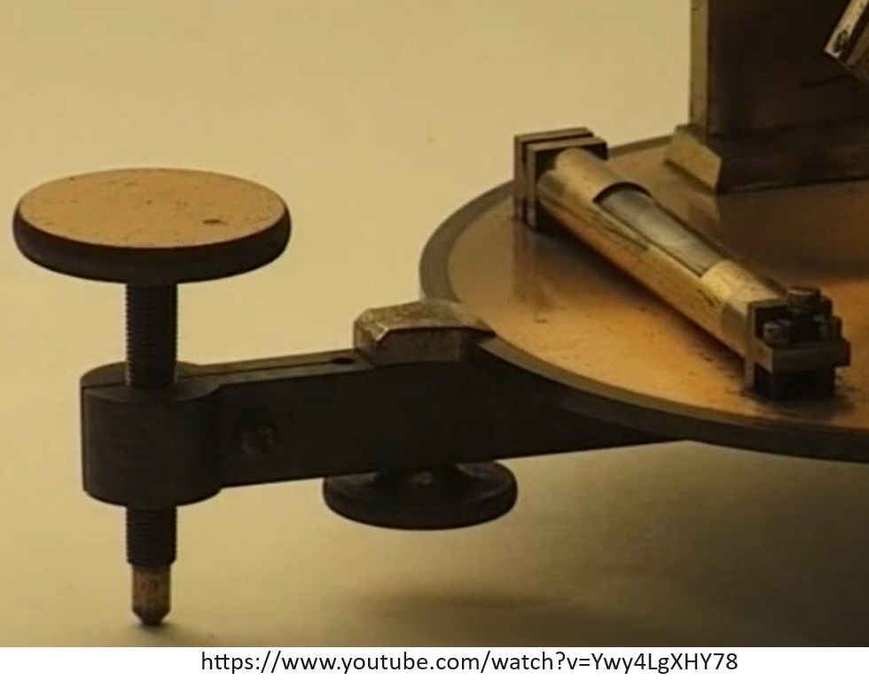

Progettato da Jean-Thiébault Silbermann, costruito da Jean-Baptiste Soleil.

# Particolari

Pinza di serraggio del tubo di direzionamento orizzontale del riflesso

Pinza di fissaggio del piatto girevole, usato per orientare l'apparecchio sul piano meridiano

Scala riportata sull'arco di declinazione, per regolare lo strumento sulla data corretta

Pinze di fissaggio, e manopola non identificata

Pinnula per collimare lo strumento coi raggi solari

Quadrante orario

Quadrante per lettura declinazione

# Fonti

- [Traité élémentaire de physique théorique et expérimentale avec les applications à la météorologie et aux arts industriels à l'usage des Facultés, des établissements d'enseignement secondaire et des écoles spéciales du Gouvernement](https://archive.org/details/bub_gb_8-k5-57FCcYC/page/70/mode/2up?q=silbermann), di  P. A. Daguin  (p.70)

